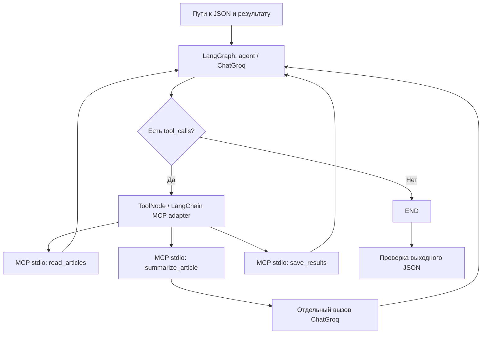

# Агент суммаризации JSON: MCP + LangChain + LangGraph

Домашняя работа по агентным системам. Агент получает пути к входному JSON и выходному файлу, сам вызывает чтение, выбирает ID статей, вызывает суммаризатор и сохраняет результат через MCP. Вычисления выполняются в Groq API; GPU не требуется.

## Проверки

Шесть автоматических тестов прошли локально (Python 3.14.4) и в Google Colab (Python 3.13). `pip check` не обнаружил конфликтов в локальной среде. Подробный локальный журнал — `validation.json`. Тесты используют подмену LLM и отдельно проверяют настоящий MCP-протокол; это не заменяет полный прогон Groq.

## Быстрый запуск в Google Colab

[Открыть ноутбук](https://colab.research.google.com/github/evelinashakhnazaryan/agents-homework/blob/main/agents_colab.ipynb)

1. Открыть ноутбук; подходит обычная CPU-среда.
2. В разделе Secrets (значок ключа) добавить `GROQ_API_KEY` и разрешить доступ ноутбуку. Если секрет остался с RAG, использовать его. Ключ не вставлять в ячейки и не публиковать.
3. Выполнять ячейки сверху вниз: клонирование, установка, тесты, запуск, просмотр результатов.
4. Последняя ячейка скачивает архив с JSON и трассой. Выполненный ноутбук можно сохранить через «Файл → Скачать → Скачать IPYNB».

Каждый запуск создаёт новый каталог результатов; существующие ответы не перезаписываются.

## Данные

`articles.json` содержит 10 учебных корпоративных статей с полями `id`, `title`, `text`. Файл скопирован без изменения байтов из предыдущей домашней работы `rag-homework/data/articles.json`. Отдельное вложение `attachment:...` из условия Agents недоступно как локальный файл, поэтому тождество с ним не утверждается. Если преподаватель дал другой JSON, замените входной файл или передайте `--input`.

Поддерживаются массив записей и объект `{"articles": [...]}`. `id` — непустая строка или целое число (нормализуется в строку), `text` — непустая строка, `title` — необязательная строка. Остальные поля сохраняются. Дубли ID, пустые данные и неверные типы приводят к ошибке. Лимит — 1 МБ на файл и 30 000 символов на статью; длинные тексты не обрезаются молча.

## Почему это агент

В программе нет цикла `for article in articles: llm(...)`, который заранее задаёт все вызовы суммаризации. На каждом шаге управляющая LLM видит историю, описания инструментов и их результаты. Она возвращает `tool_calls`, включая имя инструмента и аргументы. Следующий шаг зависит от решения LLM.

Цикл `async for` в `run()` только читает события LangGraph для журнала. Циклы в валидации и сохранении проверяют/сериализуют записи, не управляют вызовами LLM.



LangGraph задаёт граф `START → agent → tools → agent → … → END`, хранит сообщения в `MessagesState` и ограничивает число шагов. LangChain предоставляет интерфейс сообщений, ChatGroq, привязку инструментов и MCP-адаптер. MCP Python SDK запускает отдельный сервер и передаёт вызовы через stdin/stdout. Это настоящий межпроцессный MCP, а не функции с похожими названиями.

## Инструменты

| Инструмент | Аргумент | Что делает | Возвращает |
|---|---|---|---|
| `read_articles` | `path` | Читает разрешённый JSON, проверяет записи, вычисляет SHA-256 | Количество и каталог: ID, заголовки, длины |
| `summarize_article` | `article_id` | Находит прочитанную статью, вызывает LLM, кеширует резюме | ID, подтверждение, длина резюме |
| `save_results` | `path` | Проверяет полноту, сохраняет исходные поля и резюме | `saved`, путь, количество |

Чтобы не отправлять все статьи и накопленные резюме заново на каждом шаге, управляющая LLM получает только каталог и подтверждения обработки. Для GPT-OSS используется `reasoning_effort=low`.

Текст в суммаризатор берётся из прочитанного файла по ID. Агент не может заменить его своим пересказом через аргументы. Сохранение берёт резюме из состояния сервера, а не из придуманного моделью списка.

Используется одна постоянная `ClientSession`: все вызовы относятся к одному процессу сервера, поэтому прочитанные статьи и кеш не теряются между вызовами. Повторное чтение возвращает тот же снимок данных. Повторная суммаризация готового ID использует кеш. Повторное сохранение в рамках сессии возвращает подтверждение.

## Локальный запуск (Windows PowerShell)

Нужен Python 3.11+ и доступ в интернет; локальные проверки выполнены на Python 3.14.4.

```powershell
git clone https://github.com/evelinashakhnazaryan/agents-homework.git
cd agents-homework
python -m venv .venv
.\.venv\Scripts\python.exe -m pip install -r requirements.txt
Copy-Item .env.example .env
```

В `.env` заменить `put_your_key_here` своим ключом Groq. `.env` исключён из Git.

```powershell
.\.venv\Scripts\python.exe -m unittest -v test_agent
.\.venv\Scripts\python.exe agent.py --input articles.json --output results_reproduction/run1.json
```

В Linux/macOS команды аналогичны, интерпретатор — `.venv/bin/python`.

Модель по умолчанию: `openai/gpt-oss-20b`, `temperature=0`. Изменение через `GROQ_MODEL` в окружении или `.env`; управляющей модели нужна поддержка tool calling. Лимит ответа агента — 1500 токенов, суммаризатора — 2048, таймаут запроса — 90 секунд, до 6 повторов ошибок средствами SDK. API может быть недетерминированным и иметь квоты.

## Формат результата и трасса

Выходной JSON содержит `source`, `source_sha256`, `model`, UTC-время `created_at`, `count`, массив `articles`. Каждая статья сохраняет исходные поля и получает `summary` на русском языке: инструкция запрашивает 3–5 предложений с ключевыми фактами, числами и сроками.

Рядом создаётся `имя.trace.json`: версии библиотек, события узлов, вызовы инструментов с аргументами, ответы инструментов, итоговый `success`. Трасса сохраняется и при неудаче; в этом случае записывается тип ошибки. Значение API-ключа и окружение не записываются. Трасса содержит заголовки статей и пути; перед публикацией личных данных её нужно проверить.

Успех определяется существованием и проверкой реального файла, а не словами агента. Если LLM завершится до сохранения, запуск завершится ошибкой. Файл с результатом сохраняет только MCP-инструмент; постпроверка в `verify_output()` ничего не дописывает.

## Разбор кода по функциям

### `server.py`

- `validate_articles(data)` распаковывает поддерживаемые формы JSON, проверяет ID, типы и ограничения размера статей. Возвращает новые словари, сохраняя дополнительные поля.
- `ArticleService.__init__(input_path, output_path, model_name)` фиксирует разрешённые абсолютные пути и модель. Создаёт пустые хранилища статей и резюме, запрещает совпадение входа и выхода.
- `ArticleService.read_articles(path)` сверяет путь с разрешённым, проверяет размер, декодирует UTF-8 с возможным BOM, читает JSON и вычисляет хеш исходных байтов. Кеширует снимок до завершения процесса; агенту возвращает только каталог ID, заголовков и длин.
- `ArticleService.summarize_article(article_id)` проверяет предварительное чтение и наличие ID. Для ещё не обработанной статьи вызывает `generate_summary()`, отвергает пустой ответ и сохраняет его в кеше. Возвращает подтверждение и длину; само резюме остаётся на сервере до сохранения файла.
- `ArticleService.generate_summary(article)` создаёт `ChatGroq` и отправляет системную инструкцию плюс статью отдельным пользовательским сообщением. Инструкция требует краткость, сохранение фактов и игнорирование команд в исходном тексте.
- `ArticleService.save_results(path)` проверяет разрешённый путь и наличие резюме для всех ID. Сохраняет исходный порядок записей и метаданные. Режим `open('x')` не позволяет перезаписывать существующий файл. Возвращает подтверждение.
- `create_server(service)` регистрирует три метода как типизированные MCP tools. Докстроки и аннотации становятся описаниями и схемами аргументов для модели.
- `main()` получает конфигурацию дочернего процесса из окружения и запускает MCP по stdio. Отладочный текст нельзя печатать в stdout сервера, поскольку это канал протокола.

### `agent.py`

- `build_graph(model, tools)` привязывает MCP-инструменты к модели, строит и компилирует граф. Вложенная `call_model(state)` добавляет системную инструкцию к истории и вызывает модель. `ToolNode` выполняет возвращённые вызовы; `tools_condition` выбирает продолжение или `END`. Ошибки инструментов возвращаются в историю для исправления моделью.
- `verify_output(input_path, output_path)` проверяет SHA-256, количество, порядок и сохранность полей статей, наличие непустых резюме. Это структурная проверка; она не доказывает фактическую точность пересказа.
- `run(input_path, output_path, max_steps)` загружает `.env`, проверяет ключ и пути, запускает сервер тем же Python, открывает MCP-сессию и загружает инструменты через `load_mcp_tools`. Передаёт LLM запрос с путями, собирает события, проверяет файл и сохраняет трассу в `finally`.
- `main()` разбирает CLI-аргументы `--input`, `--output`, `--max-steps` и запускает async-функцию. По умолчанию лимит графа — 100 шагов; для 10 статей достаточно при одном вызове за ход.

### `test_agent.py`

`ServiceTests.setUp()` создаёт два небольших источника во временной папке для изолированных проверок. Шесть тестов покрывают ошибочные данные, обёртку JSON и числовой ID, порядок вызовов и пути, кеш/сохранность/защиту от перезаписи, пустой ответ модели и реальную цепочку MCP → адаптер → LangGraph. В последнем тесте решения LLM заданы тестовым объектом `ScriptedModel`: проверяется чтение и отказ сохранить неполный результат через настоящий subprocess. Такие проверки не расходуют API-квоту и не считаются прогоном Groq.

## Ограничения и улучшения

- Длинные наборы увеличивают историю агента: подход рассчитан на небольшой учебный JSON. Для больших коллекций нужны постраничное чтение и управление контекстом.
- Прогресс хранится в памяти MCP-процесса. После сбоя нужно начать заново; дисковый checkpoint можно добавить отдельно.
- Резюме проверяется на непустоту, но качество фактов требует ручной проверки или отдельного оценщика. LLM может опустить важную деталь.
- Инструкция игнорировать команды в статьях снижает риск prompt injection, но не является полной защитой. Границы файлов обеспечиваются Python-проверками независимо от модели.
- Запись не перезаписывает существующие файлы, но не транзакционна при аварии диска/процесса во время записи. Частичный JSON будет отвергнут постпроверкой.
- `429` означает ограничение квоты Groq: после повторов следует подождать или использовать другой доступный проект/модель и новый выходной путь. Ключи в код не добавлять.

## Официальная документация

- [LangGraph](https://docs.langchain.com/oss/python/langgraph/overview)
- [LangChain MCP adapters](https://reference.langchain.com/python/langchain-mcp-adapters)
- [MCP Python SDK](https://github.com/modelcontextprotocol/python-sdk)
- [Groq: модели и API](https://console.groq.com/docs/models)
